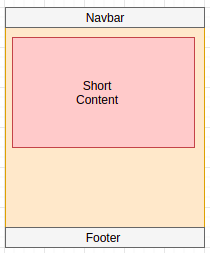
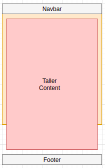

# Add and Keep That Damn Footer at the Bottom

I have kept it minimal, only showing two pages:

**First page**:

Footer at the bottom of the page, leaving space between it and short content



**Second page**:

Footer beneath the content, even when the content is taller than hte viewport



### See it Yourself
Download project:

```python
$ git clone git@github.com:GitauHarrison/proper-flask-footer.git # you can use HTTP
```

Move into the project:

```python
$ cd proper-flask-footer
```
Activate your virtual environment:

```python
$ workon your-virtual-env
```

Install useful extensions or dependancies:

```python
$ pip3 install -r requirements.txt
```

Run application:

```python
$ flask run # check your localhost
```

Learn how to view localhost project on another mobile device [here](https://github.com/GitauHarrison/notes/blob/master/localhost_testing.md).